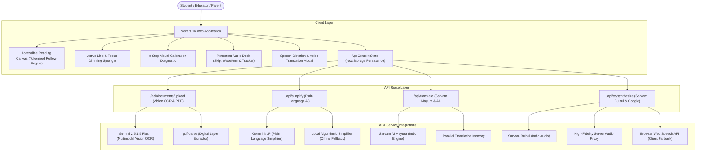

# 📖 AksharSetu (अक्षरसेतु)
### *Bridging Every Mind to the Written Word*
> **An AI-powered, multimodal, and multilingual accessible reading companion engineered for individuals with dyslexia, ADHD, visual tracking challenges, and diverse learning differences across 13 Indic & global languages.**

[](https://nextjs.org/)
[](https://www.typescriptlang.org/)
[](https://tailwindcss.com/)
[](https://aistudio.google.com/)
[](https://sarvam.ai/)
[](https://www.w3.org/WAI/standards-guidelines/wcag/)
[](https://opensource.org/licenses/MIT)

---

## 📌 Problem Background & Inclusive Vision

Reading difficulty is neither rare nor one-size-fits-all:

- **35+ Million Learners Affected**: Dyslexia impacts **6.2% to 15%** of Indian schoolchildren.
- **Policy & Legal Alignment**: Recognized as a Specific Learning Disability under the **Rights of Persons with Disabilities (RPwD) Act, 2016** and strongly aligned with **NEP 2020's** mandate for equitable, tech-enabled inclusive education.
- **Why Generic Solutions Fail**: Scientific research (*Annals of Dyslexia*) proves that static "dyslexia fonts" alone do not solve reading hurdles. What truly assists comprehension is **multimodal personalization**: customizable letter/word tracking, spacious saccadic line rhythms, anti-glare warmth, b/d disambiguation, synchronized read-aloud karaoke tracking, and multi-tier linguistic simplification.

**AksharSetu** delivers a complete ecosystem that reflows any textbook, worksheet, or digital document to the reader's unique cognitive profile.

---

## 🚀 Core Features & Capabilities

### 1. 🎯 Interactive 8-Step Visual Calibration Engine
- Gamified visual A/B diagnostic testing font apertures, line heights (1.4x–2.8x), letter spacing, word tracking, anti-glare color palettes, and reading ruler heights.
- Generates an individualized **Reading Profile** saved locally and exportable as JSON.

### 2. 🔤 Confusable Letter Disambiguation & Bionic Fixations
- **Confusable Letter Markers**: Differentiates mirror pairs like `b/d`, `p/q`, `m/w`, and `n/u` with custom typographic weights, distinct amber/green cues, underlines, or under-dots.
- **Bionic Reading Fixations**: Automatically bolds initial word phonemes to guide eye saccades smoothly across sentences.

### 3. 📄 Universal Document & Multimodal Vision OCR Engine
- **Full Ingestion Support**: Upload any digital textbook PDF, scanned worksheet, image (`.png`, `.jpg`, `.jpeg`, `.webp`), or plain text file.
- **Multimodal Vision OCR**: Integrated with Google Gemini (2.5/1.5 Flash) and OpenAI Vision to transcribe physical textbook photos and low-contrast scanned worksheets.
- **Visual Extraction Pipeline**: Multi-stage animated pipeline (`Upload` ➔ `OCR` ➔ `Extract` ➔ `Reflow`) with real-time extracted preview snippet and direct 1-click reader opening.
- **Automatic Classification**: Intelligently categorizes uploaded material into `Science`, `History`, `English`, `Mathematics`, or `General`.

### 4. 🌐 Multilingual Indian & Global Language Support (13 Languages)
Native script rendering, contextual translations, and phonetic integrity across:
- **Indic Languages (11)**: Hindi (हिन्दी), Marathi (मराठी), Bengali (বাংলা), Tamil (தமிழ்), Telugu (తెలుగు), Odia (ଓଡ଼ିଆ), Gujarati (ગુજરાતી), Kannada (ಕನ್ನಡ), Malayalam (മലയാളം), Punjabi (ਪੰਜਾਬੀ), English.
- **Global Languages (2)**: Spanish (Español), French (Français).
- **Sarvam AI Mayura Integration**: Dedicated translation pipeline powered by Sarvam AI (`mayura:v1`) with fallback AI completions and instant zero-latency pre-computed translations.
- **Auto-Bound Accent Tracking**: Switching the document language automatically updates the speech synthesis engine to use native Indic accents.

### 5. 🎙️ Real-time Speech Dictation & Voice Translation
- **Voice-to-Text Ingestion**: Speak in any language using microphone dictation with real-time streaming transcripts.
- **Cross-Lingual Voice Translation**: One-click translation of spoken voice into any target Indic or global language.
- **Dual Voice Playback**: Listen to both source spoken transcripts and translated speech with synchronized audio.
- **Save as Document**: Directly export spoken notes or lectures into an accessible reading document in the user library.

### 6. 🔊 Dual-Engine High-Fidelity Audio Dock & Karaoke Tracking
- **High-Fidelity Server Audio**: Routes through `/api/tts/synthesize` (Sarvam Bulbul Indic Audio & Google TTS) for natural human-like pronunciation in all supported languages.
- **15-Second Cutoff Prevention**: Custom sentence chunking and synthetic boundary heartbeats in Web Speech API to guarantee continuous, uninterrupted speech on all browsers.
- **Token-Accurate Click-to-Play**: Clicking any word starts audio playback from that exact position (`wordOffset`), maintaining 100% visual highlight synchronization.
- **Persistent Floating Audio Dock**:
  - Play / Pause / Stop controls
  - Sentence navigation buttons (`SkipBack` and `SkipForward`)
  - Speech playback rate cycler (`0.75x`, `1.0x`, `1.25x`, `1.5x`, `2.0x`)
  - Live animated equalizer soundwave and real-time word counter (`Word X of Y`).

### 7. 🎯 Active Line Focus Section & Optical Reading Ruler
- **Active Line Highlighting**: Select `highlightMode: 'line'` to spotlight the currently spoken sentence with an amber indicator badge and clear borders.
- **Focus Mode Spotlight Mask**: Dims non-active background paragraphs during playback to reduce cognitive overload and saccadic disorientation.
- **Optical Reading Ruler Guide**: Smoothly tracks mouse movement or synchronizes with active spoken text, with customizable ruler heights (40px–140px).

### 8. 🧠 WCAG Plain Language AI Text Simplification
- **Light Simplification**: Swaps archaic and multi-syllabic vocabulary with everyday conversational terms.
- **Medium Simplification**: Shortens compound sentences into clear statements under 14 words each.
- **Heavy Simplification**: Restructures dense paragraphs into clean, bulleted key takeaways (`•`).
- **Zero-Key Local Algorithmic Engine**: Includes a 60+ vocabulary simplifier and sentence breaker that operates fully offline even without external API keys.

### 9. 🛡️ Clinical Assessment & IEP Ingestion
- Upload optometric contrast recommendations, school IEPs, or psychoeducational evaluation PDFs to automatically pre-tune reading comfort settings.

### 10. 🎨 Ivory Clarity Design System
- Built on calming, scientifically tested anti-glare palettes:
  - **Warm Cream** (`#FEF9EB` / `#26231E`) — Primary Anti-Glare
  - **Soft Mint** (`#EDF5EC` / `#1E3A2F`) — Calming Contrast
  - **Muted Sunset** (`#FAF1DA` / `#422006`) — Low Blue-Light
  - **Deep Charcoal** (`#1C1917` / `#F5F5F4`) — High-Contrast Dark

---

## 🏗️ Technical Architecture



---

## 🛠️ Technology Stack

| Domain | Technologies & Libraries |
| :--- | :--- |
| **Framework** | [Next.js 14.2](https://nextjs.org/) (App Router, Server Components & Route Handlers) |
| **Language** | [TypeScript 5.5](https://www.typescriptlang.org/) (Strict Mode) |
| **Styling** | [Tailwind CSS 3.4](https://tailwindcss.com/) with Ivory Clarity accessible color system |
| **Icons & Assets** | [Lucide React](https://lucide.dev/) |
| **Document Processing** | `pdf-parse` + Gemini Multimodal Vision API |
| **AI Providers** | Google Gemini 3.0 Flash, Sarvam AI (Mayura & Bulbul), OpenAI GPT-4o-mini |
| **Audio Processing** | HTML5 Web Audio Stream + Web Speech Synthesis API |
| **Deployment** | [Vercel](https://vercel.com/) (Edge / Serverless Functions) |

---

## 📁 Repository Structure

```
akshar-setu/
├── src/
│   ├── app/
│   │   ├── api/
│   │   │   ├── documents/upload/    # PDF / TXT ingestion & OCR route
│   │   │   ├── simplify/            # Plain Language AI text simplifier
│   │   │   ├── translate/           # 13-language translation endpoint
│   │   │   └── tts/synthesize/      # Server-side audio synthesis endpoint
│   │   ├── calibrate/               # 8-step visual diagnostic page
│   │   ├── library/                 # Document library & category filters
│   │   ├── login/                   # User profile & role sign-in
│   │   ├── profile/                 # Reading profile & BYOK settings
│   │   ├── read/                    # Dynamic reader route ([id])
│   │   ├── layout.tsx               # Root layout with AppProvider
│   │   └── page.tsx                 # Interactive landing & quick start
│   ├── components/
│   │   ├── calibration/             # Calibration round cards & A/B testers
│   │   ├── common/                  # Buttons, Modals, Sliders, ToggleSwitches
│   │   ├── documents/               # DocumentCards, UploaderModal, IEPModal
│   │   ├── landing/                 # Landing hero, feature highlights & showcase
│   │   ├── navigation/              # Accessible top navbar & mobile drawer
│   │   ├── profile/                 # Profile editor & JSON exporter
│   │   └── reader/                  # ReadingContent, AudioDock, FocusOverlay, Rulers
│   ├── context/
│   │   └── AppContext.tsx           # Global state (documents, audio, preferences)
│   ├── data/
│   │   ├── calibrationRounds.ts     # Visual diagnostic round definitions
│   │   ├── mockDocuments.ts         # Pre-loaded educational curriculum lessons
│   │   └── themes.ts                # Anti-glare color palettes & font configurations
│   ├── lib/
│   │   ├── ai-provider.ts           # Unified multi-provider LLM executor
│   │   └── utils.ts                 # Font families & CSS styling utilities
│   ├── services/
│   │   ├── calibrationService.ts    # Preference compilation algorithm
│   │   ├── documentService.ts       # Document persistence & category detector
│   │   ├── pdf.service.ts           # Structural PDF cleaner & language detector
│   │   ├── profileService.ts        # Reading profile JSON manager
│   │   ├── readingService.ts        # Session analytics (WPM, words read)
│   │   ├── simplificationService.ts # Local + AI text simplification service
│   │   ├── translationService.ts    # Multilingual translation service
│   │   └── ttsService.ts            # Dual-engine server audio + Web Speech TTS
│   └── types/
│       └── index.ts                 # TypeScript data contracts & models
├── .env.example                     # Environment variables template
├── .gitignore                       # Protected local secrets & build artifacts
├── next.config.js                   # Next.js optimization configuration
├── package.json                     # Project manifest & dependencies
├── tailwind.config.ts               # Custom color tokens & fonts
└── tsconfig.json                    # TypeScript compiler configuration
```

---

## ⚡ Quick Start (Local Setup)

### Prerequisites
- Node.js `18.18.0` or higher
- npm, yarn, or pnpm

### 1. Clone & Install Dependencies
```bash
git clone https://github.com/CODExGAMERZ/akshar-setu.git
cd akshar-setu
npm install
```

### 2. Configure Environment Variables (Optional)
Copy `.env.example` to `.env.local`:
```bash
cp .env.example .env.local
```

Add your API keys (optional — the platform includes full offline algorithmic fallbacks):
```env
# 1. Google Gemini (For Multimodal OCR & AI Simplification)
GEMINI_API_KEY=your_gemini_api_key_here

# 2. Sarvam AI (For High-Accuracy Indic Translation & Speech)
SARVAM_API_KEY=your_sarvam_api_key_here

# 3. OpenAI / Groq (Optional)
OPENAI_API_KEY=
GROQ_API_KEY=
```

### 3. Run Development Server
```bash
npm run dev
```

Open [http://localhost:3000](http://localhost:3000) in your browser.

---

## 🚢 Deploying to Vercel

AksharSetu is engineered to deploy seamlessly on [Vercel](https://vercel.com/):

1. Push your repository to GitHub.
2. Import the project into the **Vercel Dashboard**.
3. In **Settings → Environment Variables**, add:
   - `GEMINI_API_KEY`
   - `SARVAM_API_KEY`
4. Click **Deploy**.

Vercel will compile all static pages and serverless API functions automatically with zero configuration required.

---

## 👥 Team & Contributors

Built with ❤️ for the **Smart India Hackathon** to foster inclusive, accessible education for neurodivergent and regional language learners:

| # | Member | Role & Contribution | GitHub Profile |
| :-: | :--- | :--- | :--- |
| 1 | **Chiraag Agarwal** | Team Lead • Architecture & System Design | [@chiraagagarwal](https://github.com/chiraagagarwal) |
| 2 | **Aryan** | AI Engineering • Indic NLP & Speech Systems | [@CODExGAMERZ](https://github.com/CODExGAMERZ) |
| 3 | **Katyayani Pandit** | UI/UX Design & Pedagogical Research | [@katyayanip1001-byte](https://github.com/katyayanip1001-byte) |
| 4 | **Sneha Nandi** | Project Planning & Accessibility Research | [@25156124-cmd](https://github.com/25156124-cmd) |
| 5 | **Sanjana Pathak** | Frontend Engineering & Research | [@PathakSanjana](https://github.com/PathakSanjana) |
| 6 | **Kundan Kumar** | UI/UX Design & User Research | [@Kundan840](https://github.com/Kundan840) |

---

## 📜 License

This project is licensed under the **MIT License** — free to use, modify, and distribute for educational, non-profit, and accessibility purposes.
