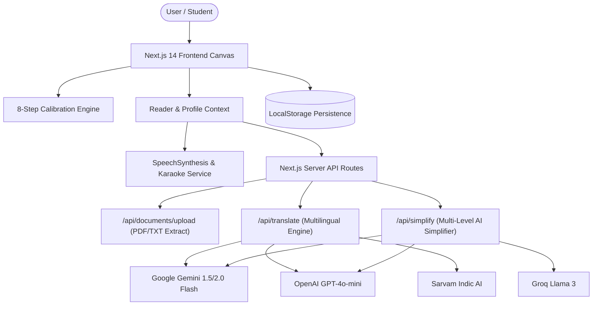

# 📖 AksharSetu (अक्षरसेतु)
### *Bridging Every Mind to the Written Word*
> **A personalized, multilingual, and AI-powered reading companion engineered for individuals with dyslexia and diverse learning differences across Indian languages.**

[](https://nextjs.org/)
[](https://www.typescriptlang.org/)
[](https://tailwindcss.com/)
[](https://opensource.org/licenses/MIT)
[](https://vercel.com/)

---

## 📌 Problem Background & Impact

Reading difficulty is neither rare nor one-size-fits-all:

- **Tens of Millions Affected**: Studies indicate that dyslexia affects **6.2% to 15%** of Indian schoolchildren (spanning over 35+ million learners).
- **Policy & Legal Mandate**: Recognised under the **Rights of Persons with Disabilities Act, 2016** as a Specific Learning Disability, and strongly aligned with **NEP 2020's** mission for equitable, tech-enabled inclusive education.
- **Why Generic Tools Fail**: Research (including recent meta-analyses in the *Annals of Dyslexia*) proves that single solutions like static "dyslexia fonts" do not work universally. What truly helps is **multimodal personalization**: customized letter spacing, word tracking, line rhythm, high-contrast anti-glare palettes, synchronized audio read-aloud, and native Indian language support.

**AksharSetu** solves this by putting the reader in complete control through an interactive calibration engine and AI-driven assistive tools.

---

## 🚀 Key Modules & Capabilities

### 1. 🎯 Interactive 8-Step Calibration Engine
- A gamified, interactive visual A/B diagnostic that tests font apertures, line height, letter tracking, word spacing, background tint, and line-length caps.
- Builds an individualized **Reading Profile** stored persistently in localStorage.

### 2. 🌐 Multilingual Indian Language Engine (7 Languages)
- Instant translation and native script rendering across **English**, **Hindi (हिन्दी)**, **Odia (ଓଡ଼ିଆ)**, **Bengali (বাংলা)**, **Tamil (தமிழ்)**, **Telugu (తెలుగు)**, and **Marathi (मराठी)**.
- Full phonetic and typographical integrity for Indic scripts (Devanagari, Eastern Nagari, Tamil, Telugu, Odia).

### 3. 🧠 Generative AI Text Simplification
- **Light**: Replaces complex/academic vocabulary with common everyday words while maintaining paragraph layout.
- **Medium**: Rewrites text in clear, conversational statements (under 14 words per sentence).
- **Heavy**: Restructures dense paragraphs into clean, bulleted key takeaways (`•`) for maximum cognitive ease.
- Supports native simplification in all 7 supported languages.

### 4. 🔊 Assistive Text-to-Speech (TTS) & Karaoke Word Tracking
- High-fidelity Web Speech API synthesizer with intelligent voice matching and phonetics fallback.
- Real-time word boundary karaoke tracker highlighting each spoken word synchronously.
- Speed control (0.75x, 1.0x, 1.2x) and Chrome 15-second speech cutoff protection.

### 5. 📏 Visual Comfort & Focus Tools
- **Digital Reading Focus Ruler**: Amber-tinted tracking ruler following the cursor/touch to prevent visual crowding and line jumping.
- **Syllable Breakpoint Insertion**: Visual middle-dots (`·`) dividing multisyllabic words to ease phonetic decoding.
- **Anti-Glare Palettes**: Warm Cream, Soft Peach, Mint Tint, High-Contrast Dark, and Pure Paper.
- **Scientific Typography**: Lexend, Atkinson Hyperlegible, OpenDyslexic, Open Sans, Verdana, and Calibri.

### 6. 🔐 Zero-Leak Server AI & BYOK (Bring Your Own Key)
- **Built-in Server AI (Zero Key Leakage)**: Server-side environment variables run securely on Next.js Route Handlers without exposure to client bundles.
- **BYOK (Bring Your Own Key)**: Users can plug in personal **Google Gemini (1.5 / 2.0 Flash)**, **OpenAI (GPT-4o)**, **Groq (Llama 3)**, or **Sarvam AI** keys directly in Settings.

---

## 🏗️ Technical Architecture



---

## 🛠️ Technology Stack

- **Framework:** [Next.js 14](https://nextjs.org/) (App Router, Server Route Handlers)
- **Language:** [TypeScript 5.5](https://www.typescriptlang.org/)
- **Styling:** [Tailwind CSS 3.4](https://tailwindcss.com/) with Material Design 3 tokens
- **Document Parser:** `pdf-parse` for seamless PDF/TXT extraction
- **AI Integrations:** Google Gemini 1.5/2.0, OpenAI GPT-4o-mini, Groq, Sarvam AI
- **Icons & Fonts:** Google Material Symbols, Lexend, Atkinson Hyperlegible, OpenDyslexic

---

## ⚡ Quick Start (Local Setup)

### Prerequisites
- Node.js 18.17+ or higher
- npm or yarn

### 1. Install Dependencies
```bash
npm install
```

### 2. Configure Environment Variables (Optional)
Copy `.env.example` to `.env.local`:
```bash
cp .env.example .env.local
```
Add your API key (optional — app includes graceful fallback engines):
```env
GEMINI_API_KEY=your_gemini_api_key_here
```

### 3. Run Development Server
```bash
npm run dev
```
Open **[http://localhost:3000](http://localhost:3000)** (or port 3001) in your browser.

---

## 🚢 Deploying to Vercel via GitHub

### Step 1: Push Code to GitHub
```bash
git init
git add .
git commit -m "feat: complete AksharSetu multilingual accessible reading platform"
git branch -M main
git remote add origin https://github.com/<your-username>/akshar-setu.git
git push -u origin main
```

### Step 2: Deploy on Vercel
1. Log in to **[Vercel](https://vercel.com/)** using your GitHub account.
2. Click **"Add New..."** → **"Project"**.
3. Select your `akshar-setu` repository and click **Import**.
4. *(Optional)* In **Environment Variables**, add:
   - `GEMINI_API_KEY` (Free from [Google AI Studio](https://aistudio.google.com/))
5. Click **Deploy**.

Vercel will build and launch your application globally!

---

## 👥 Team & Contributors (6 Members)

A huge thank you to the 6-member team building inclusive, accessible educational technology for Smart India Hackathon:

| # | Name / Contributor | Role & Domain | GitHub Profile |
| :-: | :--- | :--- | :--- |
| 1 | **Team Lead** | Project Lead & System Design | [@username](https://github.com) |
| 2 | **Core Contributor** | Full-Stack Architecture, Next.js 14 & AI Integrations | [@CODExGAMERZ](https://github.com/CODExGAMERZ) |
| 3 | **Core Contributor** | Multilingual Indic NLP, Translation & Simplification | [@username](https://github.com) |
| 4 | **Core Contributor** | Speech Synthesis, Audio Streaming & Karaoke Engine | [@username](https://github.com) |
| 5 | **Core Contributor** | Frontend Engineering, Accessibility & UI Components | [@username](https://github.com) |
| 6 | **Core Contributor** | UI/UX Design, Document Parsing Engine & QA | [@username](https://github.com) |

> *To update names, roles, or GitHub links, simply edit this table or share the details!*

---

## 🤝 Contributing

Contributions, issues, and feature requests are welcome!

1. Fork the Project
2. Create your Feature Branch (`git checkout -b feature/AmazingFeature`)
3. Commit your Changes (`git commit -m 'feat: Add some AmazingFeature'`)
4. Push to the Branch (`git push origin feature/AmazingFeature`)
5. Open a Pull Request

---

## 📁 Repository Structure

```
├── src/
│   ├── app/
│   │   ├── api/
│   │   │   ├── documents/upload/    # PDF / TXT upload & parser
│   │   │   ├── simplify/            # Generative AI text simplifier
│   │   │   ├── translate/           # Multilingual translation endpoint
│   │   │   └── tts/synthesize/      # Server TTS endpoint
│   │   ├── calibrate/               # 8-step visual calibration test
│   │   ├── history/                 # Document library & reading history
│   │   ├── language/                # Language selection grid
│   │   ├── read/[id]/               # Main reading canvas with ruler & audio
│   │   ├── settings/                # Typography, themes & BYOK settings
│   │   ├── upload/                  # Document upload zone
│   │   ├── layout.tsx               # Root layout & providers
│   │   └── page.tsx                 # Welcome & sign-in screen
│   ├── components/
│   │   ├── layout/AppShell.tsx      # Responsive desktop/tablet/mobile shell
│   │   └── navigation/              # Adaptive headers, sidebars & bottom nav
│   ├── context/
│   │   ├── AuthContext.tsx          # Session management
│   │   └── ReaderContext.tsx        # Profile, document & audio state
│   ├── lib/
│   │   ├── ai-provider.ts           # Unified Gemini / OpenAI / Groq execution
│   │   ├── constants.ts             # Default profiles, fonts, themes & samples
│   │   └── storage.ts               # LocalStorage persistence & BYOK manager
│   ├── services/
│   │   ├── simplification.service.ts # Multi-level simplification service
│   │   ├── translation.service.ts    # Multilingual translation service
│   │   └── tts.service.ts           # Speech synthesis & karaoke engine
│   └── types/index.ts               # TypeScript data models & interfaces
├── .env.example                     # Environment variable template
├── .gitignore                       # Git ignore configuration
└── package.json                     # Project manifest & dependencies
```

---

## 📜 License

This project is licensed under the **MIT License** — free to use and extend for accessibility, non-profit, and educational purposes.

---

### 💡 Made with ❤️ for Smart India Hackathon & inclusive education.
